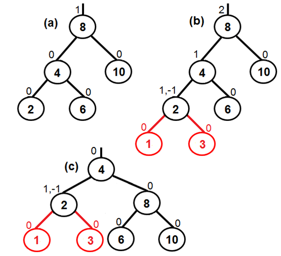
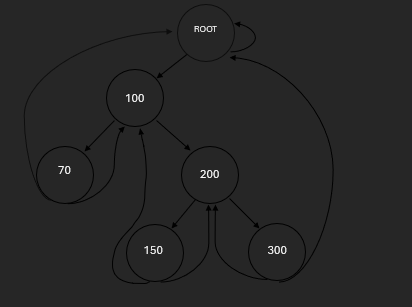

# Algoritmos en C++

Este proyecto en C++ contiene implementaciones de **listas enlazadas, polinomios, matrices, recursión, pilas, colas, operaciones numéricas y arboles**. Incluye ejercicios clásicos de algoritmos y estructuras de datos.

---

## Contenido del proyecto

### 1. Listas

- `ListaSimple.h`: Lista enlazada simple.
- `ListaPolinomios.h`: Lista de polinomios con inserción y suma.

---

### 2. Funciones de Arreglos y Matrices

| Función                                                            | Descripción                                                      |
|--------------------------------------------------------------------|------------------------------------------------------------------|
| `int sumaArreglo(const int *A, int N)`                             | Suma todos los elementos de un arreglo.                          |
| `int sumaPrimerMedioUltimo(const int *A, int N)`                   | Suma el primer, medio y último elemento del arreglo.             |
| `int sumaMatriz(int **A, int N, int M)`                            | Suma todos los elementos de una matriz NxM.                      |
| `int sumaDiagonalPrincipal(int **A, int N)`                        | Suma los elementos de la diagonal principal de una matriz NxN.   |
| `int sumaDiagonalYBajo(int **A, int N)`                            | Suma diagonal principal y elementos bajo ella de una matriz NxN. |
| `bool buscarEnArreglo(const int *A, int N, int X)`                 | Verifica si un valor `X` está en un arreglo.                     |
| `bool estaOrdenado(const int *A, int N)`                           | Verifica si un arreglo está ordenado (O(N²) por comparación).    |
| `void bubbleSort(int *A, int N)`                                   | Ordena un arreglo usando Bubble Sort.                            |
| `int sumaFilasImpares(int **A, int N, int M)`                      | Suma las filas impares de una matriz NxM.                        |
| `bool columnasIdenticas(int **A, int N, int M, int K, int P)`      | Verifica si dos columnas son idénticas.                          |
| `int sumaEsquinas(int **A, int N, int M)`                          | Suma las esquinas de una matriz NxM.                             |
| `int **multiplicarMatrices(int **A, int P, int Q, int **B, int R)` | Multiplica matrices A(PxQ) y B(QxR).                             |

---

### 3. Funciones Recursivas

| Función                                 | Descripción                               |
|-----------------------------------------|-------------------------------------------|
| `int factorial(int n)`                  | Calcula el factorial de `n`.              |
| `int fibonacci(int n)`                  | Calcula el n-ésimo número de Fibonacci.   |
| `int suma(int n)`                       | Suma los números de 1 a n.                |
| `int potencia(int base, int exponente)` | Calcula base^exponente.                   |
| `int sumaDigitos(int n)`                | Suma los dígitos de `n`.                  |
| `int contarDigitos(int n)`              | Cuenta los dígitos de `n`.                |
| `int mcm(int a, int b)`                 | Calcula el mínimo común múltiplo.         |
| `bool esPrimo(int n, int i=2)`          | Verifica si `n` es primo.                 |
| `int contarPrimos(int n)`               | Cuenta primos hasta `n`.                  |
| `int sumaPares(int n)`                  | Suma todos los números pares hasta `n`.   |
| `int sumaImpares(int n)`                | Suma todos los números impares hasta `n`. |
| `int binarioADecimal(int n)`            | Convierte un número binario a decimal.    |
| `int decimalABinario(int n)`            | Convierte un número decimal a binario.    |

---

### 4. Funciones de Pila y Cola

| Función                                                                                       | Descripción                                             |
|-----------------------------------------------------------------------------------------------|---------------------------------------------------------|
| `void invertirPila(stack<int> &s)`                                                            | Invierte los elementos de una pila.                     |
| `void barajar(stack<char> M, stack<char> &C, stack<char> &D, stack<char> &T, stack<char> &E)` | Distribuye cartas de la pila M a 4 pilas según el palo. |
| `void duplicar(int *numero)`                                                                  | Duplica el valor de un número usando puntero.           |
| `bool esPalo(const string &palabra)`                                                          | Verifica si una palabra es palíndromo.                  |

---

### 5. Funciones para Polinomios

| Función                                                  | Descripción                                                                       |
|----------------------------------------------------------|-----------------------------------------------------------------------------------|
| `void insertar(ListaPolinomios &s, const string &poli2)` | Inserta los términos de un polinomio dado como string en una lista de polinomios. |

---

### 6. Árbol Binario de Búsqueda (ABB)

Archivo: `ABB.h`

| Función                                               | Descripción                                                  |
|-------------------------------------------------------|--------------------------------------------------------------|
| `ABB()`                                               | Constructor que inicializa el árbol vacío.                   |
| `NodoABB* insertarRecursivo(NodoABB *nodo, int dato)` | Inserta un nuevo nodo recursivamente.                        |
| `void insertar(int dato)`                             | Inserta un valor en el árbol (público).                      |
| `NodoABB* getRoot()`                                  | Devuelve un puntero a la raíz del árbol.                     |
| `bool isEmpty()`                                      | Verifica si el árbol está vacío.                             |
| `void eliminar(int dato)`                             | Elimina un nodo con el valor indicado.                       |
| `void inorder(NodoABB *nodo)`                         | Recorrido inOrder (izquierda → raíz → derecha).              |
| `void preorder(NodoABB *nodo)`                        | Recorrido preOrder (raíz → izquierda → derecha).             |
| `void postorder(NodoABB *nodo)`                       | Recorrido postOrder (izquierda → derecha → raíz).            |
| `void inorderInverso(NodoABB *nodo)`                  | Recorrido inOrder inverso (derecha → raíz → izquierda).      |
| `void preorderInverso(NodoABB *nodo)`                 | Recorrido preOrder inverso (derecha → raíz → izquierda).     |
| `void postorderInverso(NodoABB *nodo)`                | Recorrido postOrder inverso (derecha → izquierda → raíz).    |
| `void toString(int opcion)`                           | Permite mostrar el árbol según el tipo de recorrido elegido. |

---

## 7. Árboles Avanzados 🌳

### 🧠 Árbol AVL (`AVL.h`)
Un **Árbol AVL** es un árbol binario de búsqueda auto-balanceado, donde la diferencia de alturas entre los subárboles izquierdo y derecho nunca supera 1.

| Método                                   | Descripción                                       |
|------------------------------------------|---------------------------------------------------|
| `void insertar(int dato)`                | Inserta un nodo y ajusta el equilibrio del árbol. |
| `void eliminar(int dato)`                | Elimina un nodo y rebalancea el árbol.            |
| `bool buscar(int dato)`                  | Verifica si un elemento existe en el árbol.       |
| `NodoAVL* rotacionIzquierda(NodoAVL* x)` | Realiza una rotación simple a la izquierda.       |
| `NodoAVL* rotacionDerecha(NodoAVL* y)`   | Realiza una rotación simple a la derecha.         |
| `int obtenerAltura(NodoAVL* nodo)`       | Retorna la altura del nodo.                       |
| `int obtenerBalance(NodoAVL* nodo)`      | Calcula el factor de equilibrio del nodo.         |

---

### 🧩 Árbol Enhebrado (`ThreadedBST.h`)
Un **Árbol Enhebrado** usa punteros adicionales (hebras) para apuntar al sucesor o predecesor en el recorrido in-order, eliminando la necesidad de recursión o pila.

| Método                                        | Descripción                                          |
|-----------------------------------------------|------------------------------------------------------|
| `void insertar(int dato)`                     | Inserta un nuevo nodo ajustando las hebras.          |
| `void eliminar(int dato)`                     | Elimina un nodo manteniendo la estructura enhebrada. |
| `NodoEn* buscar(int dato)`                    | Retorna el puntero al nodo que contiene el dato.     |
| `NodoEn* sucesor(NodoEn* nodo)`               | Retorna el sucesor in-order.                         |
| `NodoEn* predecesor(NodoEn* nodo)`            | Retorna el predecesor in-order.                      |
| `string toStringInOrder()`                    | Devuelve el recorrido in-order usando hebras.        |
  
---

### 🧱 Heap Binario (`Heap.h`)
Un **Heap** es una estructura completa usada comúnmente para implementar colas de prioridad.  
Puede ser **Max-Heap** (padres ≥ hijos) o **Min-Heap** (padres ≤ hijos).

| Método                              | Descripción                                            |
|-------------------------------------|--------------------------------------------------------|
| `void insertar(int valor)`          | Inserta un elemento manteniendo la propiedad del heap. |
| `void eliminar()`                   | Elimina la raíz (máximo o mínimo).                     |
| `int obtenerRaiz()`                 | Devuelve el valor de la raíz.                          |
| `bool buscar(int valor)`            | Verifica si un valor está en el heap.                  |
| `void heapify(int i)`               | Reestructura el árbol desde el índice `i`.             |
| `void mostrar()`                    | Imprime los elementos del heap.                        |
   |                     
---

### 🧮 Árbol B+ (`BPlusTree.h`)
Un **Árbol B+** es una estructura de datos balanceada usada en bases de datos y sistemas de archivos.  
Todos los valores están almacenados en hojas, y los nodos internos solo contienen claves de búsqueda.

| Método                                       | Descripción                                        |
|----------------------------------------------|----------------------------------------------------|
| `void insertar(int clave, int valor)`        | Inserta una clave y valor en el árbol.             |
| `void eliminar(int clave)`                   | Elimina una clave del árbol.                       |
| `NodoBPlus* buscar(int clave)`               | Busca una clave y retorna el nodo correspondiente. |
| `vector<int> obtenerRango(int min, int max)` | Devuelve todas las claves dentro de un rango.      |
| `void dividirNodo(NodoBPlus* nodo)`          | Divide un nodo lleno en dos.                       |
| `void mostrar()`                             | Muestra el contenido del árbol.                    |
|                         |                                                    |

---

📘 **Nota:** Cada estructura está diseñada para ilustrar conceptos fundamentales de organización, búsqueda y balanceo en estructuras jerárquicas de datos.
